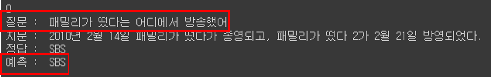
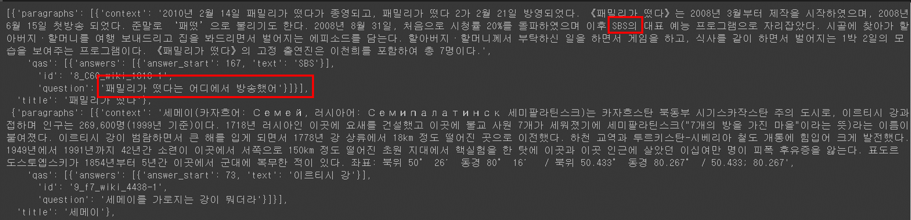
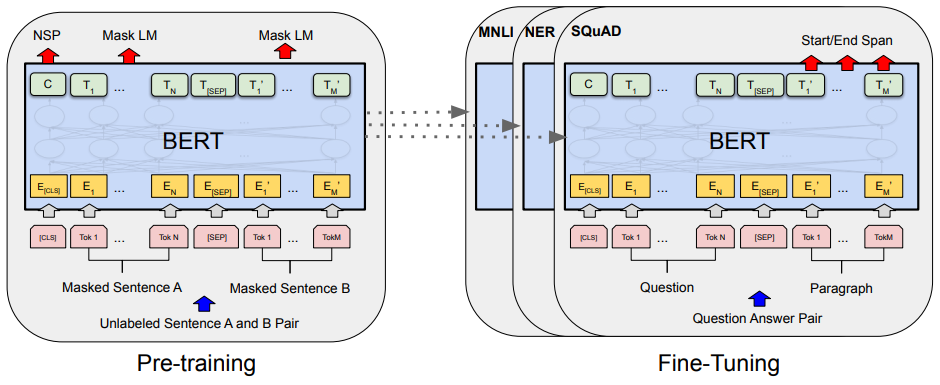

# QA
*NLP_Project: Kowiki dataset BERT fine-tuning

## Introduction

본 프로젝트는 BERT의 specific task 중 하나인 Q&A를 한국어 위키백과 데이터로 fine tuning 하고 한국어로 BERT 모델과 질의응답을 하는 것을 목표로 한다. pre-trained BERT 모델을 학습시키는 것과 한국어 질의응답 데이터를 전처리하는 능력을 키운다.




## Dataset

|Data|데이터 수|세부사항|
|:-:|:-:|:-:|
|1|750000|[aihub](https://aihub.or.kr/aihubdata/data/view.do?currMenu=115&topMenu=100&aihubDataSe=realm&dataSetSn=106), key-value 형태의 질문, 응답|


한국어 위키백과 내 주요 문서 15만 개에 포함된 지식을 추출하여 객체(entity), 속성(attribute), 값(value)을 갖는 데이터 75만 개를 구축하였다. 위키백과 본문 내용과 관련한 질문과 질문에 대응하는 wiki 백과 본문 내의 정답 쌍으로 구성된다.



질문, 정답 쌍은 해당 쌍을 포함하고 있던 문단과 함께 제공되며 QA task에 맞게 전처리를 해야 한다. 먼저, 띄어쓰기 단위로 정보를 관리하기 위해 구분을 하고 정답 영역을 subword로 토큰화한다. 이후 정답이 포함되어 있는 정답 영역의 인덱스를 라벨링 한다.

## Model



pre_trained 된 bert 모델을 fine_tuning 하여 프로젝트를 진행한다. 


## Project Structure

```
Question_And_Answering
├── pre_trained_model
├── preprocessing.py
└── bert_fine_tuning.py
```

- vocab : 위키백과 데이터 vocab
- preprocessing.py : 데이터 전처리 코드
- bert_fine_tuning.py : BERT fine-tuning 및 inference 코드


## Requirements
```
tensorflow==2.x
tensorflow-GPU==2.x
```

## reference
- [BERT: Pre-training of Deep Bidirectional Transformers for
Language Understanding](https://arxiv.org/pdf/1810.04805.pdf)
- [SQuAD: 100,000+ Questions for Machine Comprehension of Text](https://arxiv.org/pdf/1606.05250.pdf)

## Author

👤 **SangBoem-Hahn**

- Github: [@SangBoem-Hahn](https://github.com/SangBeom-Hahn)
- Blog : [Tistory(QA)](https://hsb422.tistory.com/entry/AI-hub%EC%9D%98-%EC%9D%BC%EB%B0%98%EC%83%81%EC%8B%9D-%EB%8D%B0%EC%9D%B4%ED%84%B0%EB%A5%BC-%ED%99%9C%EC%9A%A9%ED%95%9C-Question-Answering)
